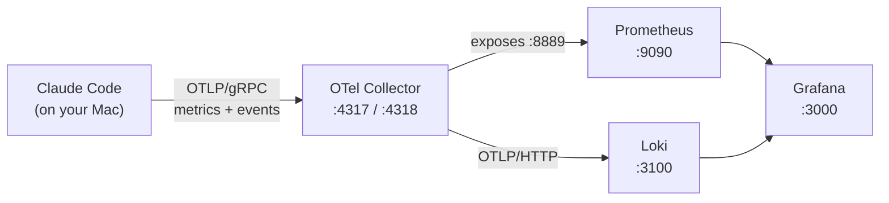

# How it works

## The pipeline



Claude Code runs **on the host**, not in Docker. The containers publish their ports to
`127.0.0.1`, so `localhost:4317` from your shell reaches the collector inside Docker. That is the
only connection between the two worlds.

## Why a collector at all?

You could point Claude Code straight at a backend. The collector earns its place for three reasons:

1. **One endpoint, many destinations.** Claude Code sends metrics *and* events to a single address.
   The collector splits them — metrics to Prometheus, events to Loki — so you configure the client
   once and change your backends freely.
2. **It translates.** Prometheus and Loki don't speak OTLP natively in a way that matches how
   Claude Code emits. The collector handles that (see *Push vs. pull* below).
3. **It's the swap point.** Want to add Honeycomb, Datadog, or a plain JSON file later? That's a
   few lines in `otel-collector-config.yaml`, with nothing to change on the Claude Code side.

## Push vs. pull — the one genuinely confusing part

Claude Code **pushes** data on an interval (`OTEL_METRIC_EXPORT_INTERVAL`, default 60s).
Prometheus **pulls** — it scrapes an HTTP endpoint on an interval of its own.

Those are opposite directions, and the collector is what turns one into the other:

- The collector *receives* pushed OTLP on `:4317`.
- Its `prometheus` exporter *keeps the current values in memory* and serves them as a plain text
  page at `:8889/metrics`.
- Prometheus scrapes `otel-collector:8889` every 15 seconds and stores what it finds.

So there are **two independent intervals** stacked on top of each other. If you set a 60-second
export interval and a 15-second scrape, your real resolution is 60 seconds — Prometheus just
re-reads the same values four times. This is why `claude-telemetry.env` drops the export interval
to 10 seconds: it makes the dashboard feel responsive while you're testing.

!!! note "Loki is push, all the way through"
    Events go collector → Loki over OTLP/HTTP with no scraping involved. Only the metrics path has
    the push/pull seam.

## Delta vs. cumulative

A counter can be reported two ways:

- **Delta** — *"18 tokens since I last told you."* Claude Code's default.
- **Cumulative** — *"1,482 tokens since this session began."* What Prometheus is built on.

Prometheus assumes counters only go up, and its `rate()` / `increase()` functions are built around
detecting resets. Feed it deltas and you get nonsense.

This stack handles it **twice**, deliberately, because either one alone is a footgun:

1. `claude-telemetry.env` sets `OTEL_EXPORTER_OTLP_METRICS_TEMPORALITY_PREFERENCE=cumulative`, so
   the client sends cumulative in the first place.
2. `otel-collector-config.yaml` runs the `delta_to_cumulative` processor, which converts anything
   that still arrives as delta.

Belt and braces. If someone starts a session without sourcing the env file, the collector still
does the right thing.

## What the collector config actually says

```yaml
service:
  pipelines:
    metrics:
      receivers: [otlp]                              # listen on 4317/4318
      processors: [delta_to_cumulative, batch]       # normalize, then group
      exporters: [prometheus]                        # serve on :8889
    logs:
      receivers: [otlp]
      processors: [batch]
      exporters: [otlp_http/loki]                    # push to Loki
```

A pipeline is `receivers → processors → exporters`. Signals (metrics, logs, traces) each get their
own pipeline, and they share components by name. That's the whole mental model — everything else in
the file is configuring the named pieces.

`batch` groups data before export instead of sending each point individually. It's recommended in
every production collector deployment and costs you nothing here.

## Metric naming: expect the suffixes

The Anthropic docs list a metric called `claude_code.token.usage`. In Prometheus you will not find
that name. You'll find:

```
claude_code_token_usage_tokens_total
```

Three transformations happened:

| Step | Why | Result |
| --- | --- | --- |
| `.` → `_` | Prometheus names can't contain dots | `claude_code_token_usage` |
| `+ _tokens` | The exporter appends the OTel **unit** | `claude_code_token_usage_tokens` |
| `+ _total` | Prometheus convention for counters | `claude_code_token_usage_tokens_total` |

This trips up everyone once. [Metrics](metrics.md) lists the real, verified names — the ones
observed coming out of this stack, not the logical names from the docs.

## Cardinality, and why Loki is configured the way it is

Every unique combination of label values creates a separate stored series. Claude Code attaches a
lot of attributes to each event, including `client_request_id` and `prompt_id` — **unique per
request**. Indexing those as Loki stream labels would create a new stream for every single API
call, which is the classic way to bring Loki to its knees.

`loki-config.yaml` therefore indexes only a small stable set:

```yaml
otlp_config:
  resource_attributes:
    ignore_defaults: true
    attributes_config:
      - action: index_label
        attributes: [service.name, service.version, host.name, os.type]
  log_attributes:
    - action: index_label
      attributes: [event.name]
```

Everything else still arrives and is still queryable — it just lands in *structured metadata*
rather than the index. You filter on the indexed labels first, then drill into the rest.

Verify it any time — this returns the indexed set and nothing else:

```bash
curl -s http://localhost:3100/loki/api/v1/labels | python3 -m json.tool
# ["event_name", "host_name", "os_type", "service_name", "service_version"]
```

!!! warning "Don't panic at the query API"
    A `query_range` response shows *every* attribute inside the `stream` object, including
    `client_request_id` and `prompt_id`. That looks like the config was ignored. It wasn't — the
    API merges structured metadata into that object for display convenience. `/loki/api/v1/labels`
    above is the authoritative answer for what's actually indexed.

The same concern applies to metrics: `session.id` is on by default and is unique per session. On a
single-user laptop that's fine. If you ever ship this to a team, set
`OTEL_METRICS_INCLUDE_SESSION_ID=false`.

## Where the data physically lives

Three named Docker volumes: `prometheus-data`, `loki-data`, `grafana-data`. They survive
`docker compose down`. To wipe everything and start clean:

```bash
docker compose down -v
```

Retention is 90 days on both Prometheus (`--storage.tsdb.retention.time=90d`) and Loki
(`retention_period: 2160h`).
